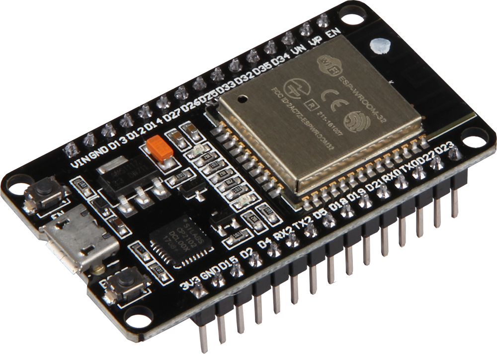

<link rel="stylesheet" href="https://www.w3schools.com/w3css/4/w3.css">
<link rel="stylesheet" href="https://cdnjs.cloudflare.com/ajax/libs/font-awesome/4.7.0/css/font-awesome.min.css">
<script src="https://ajax.googleapis.com/ajax/libs/jquery/3.6.3/jquery.min.js"></script>

## components.html
<div class="w3-row">
<div class="w3-half w3-padding">
<h2 class="w3-center">Basic</h2>
<p class="w3-center">Base component's: tag <b>img</b> and tag <b>i</b> (to create icons)</p>

```html

    



    <i class="fa fa-{{ icon }} {{ class }}"></i>

```

</div>
<div class="w3-half">
<h3 class="w3-center">Examples</h3>

```python
    {{ cImg('esp32.png', 'platforms') }}
```

<div class="w3-center w3-panel" style="height: 100px">
    
</div>

```python
    {{ cIcon('home', class='w3-large') }}
    {{ cIcon('plus', class='w3-xxlarge') }}
```
<div class="w3-center w3-panel" style="height: 100px">
    <i class="fa fa-home w3-large"></i>
    <i class="fa fa-plus w3-xxlarge"></i>
</div>
</div>
</div>

<div style="page-break-after: always;"></div>

<hr> <!-- ####################################################################################################### -->
<div class="w3-row">
<div class="w3-half w3-padding">
<h2 class="w3-center">Input</h2>
<p class="w3-center">
Input tags (text and number) and textarea
</p>

```html

    <input
        class="w3-input w3-round w3-card {{ class }}"
        type="{{ type }}"
        name="{{ name }}"
         value="{{ value }}" 
         id="{{ id }}" 
         placeholder="{{ placeholder }}" 
         disabled="disabled" 
         required="required" 
    /> 



    <textarea
        class="w3-input w3-round w3-card {{ class }}"
        name="{{ name }}"
         id="{{ id }}" 
         placeholder="{{ placeholder }}" 
         disabled="disabled" 
         required="required" 
    >{{ value }}</textarea>

```
</div>
<div class="w3-half">
<h3 class="w3-center">Examples</h3>

```python
    {{ cInput(placeholder='platforms') }}
```

<div class="w3-center w3-panel" style="height: 100px">
    <input class="w3-input w3-round w3-card" type="text" placeholder="platforms"/> 
</div>

```python
    {{ cInput(type="number", required=False, value='45', class='w3-half') }}
```

<div class="w3-center w3-panel" style="height: 100px">
    <input class="w3-input w3-round w3-card w3-half" type="number" value="45" required="required"/> 
</div>


```python
    {{ cTextArea(placeholder='description') }}
```
<div class="w3-center w3-panel" style="height: 100px">
    <textarea class="w3-input w3-round w3-card" placeholder="description"></textarea>
</div>

</div>
</div>

<div style="page-break-after: always;"></div>


<hr> <!-- ####################################################################################################### -->

<div class="w3-row">
<div class="w3-half w3-padding">
<h2 class="w3-center">Buttons</h2>
<p class="w3-center">
Link with href (same as a)
</p>

```html

    <a 
            href="{{ url or url_for(view) }}"
        
            onclick="{{ onclick }}"
        
        title="{{ title }}"
        class="w3-large w3-btn w3-round w3-card-4 {{ class }} {{ 'w3-'~color if color }}">
        {{ cIcon(icon)}}
        <span class="w3-hide-small w3-hide-medium">
            {{ label }}
        </span>
    </a>



    
        {{ cLink(label, 'arrow-left', view=view, url=url, color=color, class=class) }}
    
        {{ cLink(label, 'arrow-left', onclick='window.history.back()') }}
    

```

</div>
<div class="w3-half">
<h3 class="w3-center">Examples</h3>

```python
    {{ cLink('Settings', view='views.settings', icon='cog', title='impostazioni') }}
```

<div class="w3-center w3-panel" style="height: 100px">
    <a href='/settings' title="impostazioni" class="w3-large w3-btn w3-round w3-card-4 w3-green">
        <i class="fa fa-cog"></i><span class="w3-hide-small w3-hide-medium">Settings</span>
    </a>
</div>

```python
    {{ cLink(view='views.settings', icon='cog', title='impostazioni', class='w3-circle') }}
```

<div class="w3-center w3-panel" style="height: 100px">
    <a href='/settings' title="impostazioni" class="w3-large w3-btn w3-circle w3-card-4 w3-green">
        <i class="fa fa-cog"></i>
    </a>
</div>

```python
    {{ cBack() }}
```

<div class="w3-center w3-panel" style="height: 100px">
    <a class="w3-large w3-btn w3-round w3-card-4 w3-white">
        <i class="fa fa-arrow-left"></i><span class="w3-hide-small w3-hide-medium">Back</span>
    </a>
</div>

</div>
</div>

<div style="page-break-after: always;"></div>


<hr> <!-- ####################################################################################################### -->
<div class="w3-row">
<div class="w3-half w3-padding">
<h2 class="w3-center">Submit</h2>
<p class="w3-center">
Buttons for submit form
</p>

```html

    <button type="submit"
        id="{{ id }}"
        name="{{ name }}"
        class="w3-large w3-btn w3-round w3-{{ color }} w3-card {{ class }}">
        {{ cIcon(icon) }}
        {{ label }}
    </button>



    <div class="w3-right w3-margin">
        {{ cBack(view=view, url=url) }}
        {{ cSubmit(label=label, icon=icon)}}
    </div>


```

</div>
<div class="w3-half">
<h3 class="w3-center">Examples</h3>

```python
    {{ cSubmit('Save', 'save') }}
```

<div class="w3-center w3-panel" style="height: 100px">
    <button type="submit" class="w3-large w3-btn w3-round w3-green w3-card">
        <i class="fa fa-save"></i>
        Save
    </button>
</div>

```python
    {{ cSubmitBack('Save', 'save') }}
```

<div class="w3-center w3-panel" style="height: 100px">
    <a class="w3-large w3-btn w3-round w3-card-4 w3-white"><i class="fa fa-arrow-left"></i><span class="w3-hide-small w3-hide-medium">Back</span></a>
    <button type="submit" class="w3-large w3-btn w3-round w3-green w3-card">
        <i class="fa fa-save"></i>
        Save
    </button>
</div>


</div>
</div>

<div style="page-break-after: always;"></div>


<hr> <!-- ####################################################################################################### -->
<div class="w3-row">
<div class="w3-half w3-padding">
<h2 class="w3-center">Submit</h2>
<p class="w3-center">
Buttons for submit form
</p>

```html

<p class="w3-text-{{ color }} w3-center {{ class }}">
    {{ label|safe }}
</p>


    {{ cMessage(label, color='red') }}


    {{ cMessage(label, color='yellow') }}


    {{ cMessage(label, color='blue') }}


    {{ cMessage(label, color='green') }}


```

</div>
<div class="w3-half">
<h3 class="w3-center">Examples</h3>

```python
    {{ cMessage('Ciao come stai po?') }}
    {{ cError('Ciao come stai po?') }}
    {{ cWarning('Ciao come stai po?') }}
    {{ cInfo('Ciao come stai po?') }}
    {{ cSuccess('Ciao come stai po?') }}
```

<div class="w3-center w3-panel" style="height: 100px">
    <p class="w3-text-black w3-center">
        Ciao come stai po?
    </p>
    <p class="w3-text-red w3-center">
        Ciao come stai po?
    </p>
    <p class="w3-text-yellow w3-grey w3-center">
        Ciao come stai po?
    </p>
    <p class="w3-text-blue w3-center">
        Ciao come stai po?
    </p>
    <p class="w3-text-green w3-center">
        Ciao come stai po?
    </p>
</div>


</div>
</div>

## panels.html

<div class="w3-row">
<div class="w3-half w3-padding">
<h2 class="w3-center">Panel input</h2>
<p class="w3-center">
Link with href (same as a)
</p>

```html

    <div class="w3-panel {{ class }}">
        <label>
            {{ label }}
            {{ cInput(name, value, id, '', placeholder, required, type, disabled) }}
        </label>
    </div>



    <div class="w3-panel {{ class }}">
        <label>
            {{ label }}
            {{ cTextarea(name, value, required=True, disabled=False) }}
        </label>
    </div>

```

</div>
<div class="w3-half">
<h3 class="w3-center">Examples</h3>

```python
    {{ pInput(label='Username', value='Tomaoli') }}
```

<div class="w3-panel" style="height: 100px">
    <label> Username
        <input class="w3-input w3-round w3-card" value="Tomaoli" />
    </label>
</div>

```python
    {{ pTextarea(label='Lyric', placeholder='Text of song') }}
```

<div class="w3-panel" style="height: 100px">
    <label> Lysics
        <textarea class="w3-input w3-round w3-card" placeholder="Text of song"></textarea>
    </label>
</div>

</div>
</div>

<div style="page-break-after: always;"></div>


<hr> <!-- ####################################################################################################### -->

<div class="w3-row">
<div class="w3-half w3-padding">
<h2 class="w3-center">Panel to submit form</h2>

```html

    <div class="w3-panel">
        <div class="w3-{{ float }} {{ class }}">
            {{ cSubmit(label, icon, id, '', title, name, color) }}
        </div>
    </div>



    <div class="w3-panel">
        <div class="w3-{{ float }} {{ class }}">
            {{ cSubmitBack(label, icon, view, url, autofocus) }}
        </div>
    </div>

```

</div>
<div class="w3-half">
<h3 class="w3-center">Examples</h3>

```python
    {{ pSubmit('Save', 'save') }}
```

<div class="w3-panel" style="height: 100px">
    <button type="submit" class="w3-right w3-large w3-btn w3-round w3-green w3-card">
        <i class="fa fa-save"></i>
        Save
    </button>
</div>

```python
    {{ pSubmitBack('Delete', 'trash') }}
```

<div class="w3-panel w3-right" style="height: 100px">
    <a class="w3-large w3-btn w3-round w3-card-4 w3-white">
        <i class="fa fa-arrow-left"></i>
        <span class="w3-hide-small w3-hide-medium">Back</span>
    </a>
    <button type="submit" class="w3-large w3-btn w3-round w3-green w3-card">
        <i class="fa fa-trash"></i>
        Delete
    </button>
</div>

</div>
</div>

<div style="page-break-after: always;"></div>


<hr> <!-- ####################################################################################################### -->


